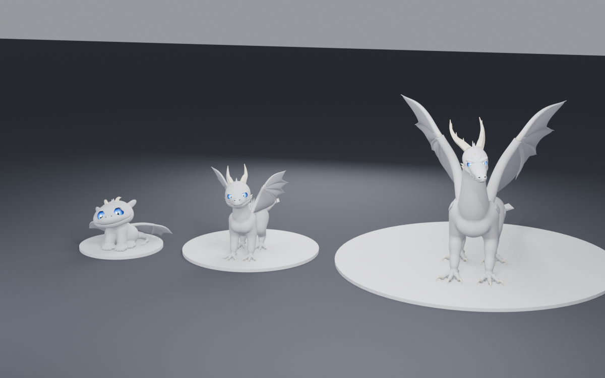

# Modèles 3D des dragons

Modèles faits dans Blender par scripts Python, pilotés depuis Claude via l'extension MCP de Blender.



## Démarche

1. **Formes d'abord** : modèle de base en gris perle, lisse, sans texture, pièces séparées (cornes, griffes, plaques, yeux, ailes).
2. **Allègement + dépliage (UV)** pour Roblox : ~4 000 triangles visés par pet, moins de 20 000 par pièce.
3. **Textures à la fin**, une par type de dragon (feu, glace, ombre…), posées sur le même modèle de base.

Les règles de forme (proportions bébé / ado / adulte) sont dans [GUIDE_FORMES.md](GUIDE_FORMES.md).

## État actuel : dragon classique, formes v3

| Stade | Référence | État |
|---|---|---|
| Bébé | bébé dragon assis, esprit « bébé dragon de film d'animation » (façon Krokmou, sans le copier) | Fait : tête large et plate penchée sur le côté, très grands yeux écartés à grosses pupilles, grand sourire d'une joue à l'autre, oreilles en lobes souples, petites cornes, pattes en « coussins » à 4 orteils, grandes ailes basses sur les côtés, queue enroulée vers l'avant avec pique en losange, crête jusqu'au 1er tiers de la queue |
| Ado | esprit « jeune dragon de jeu de plateforme » (sans copier de personnage existant) | Fait : svelte et athlétique, cou plus long, regard calme et assuré, sourire en coin avec 2 petits crocs, cornes recourbées, crête jusqu'au bout de la queue, vraies pattes de dragon |
| Adulte | grand dragon western, en version lissée | Fait : long et sec, très long cou, tête haute, yeux en amande sous une arcade, longue gueule à crocs, cornes à pointes secondaires, plaques d'armure, ailes immenses, vraies pattes de dragon |

Pattes de l'ado et de l'adulte : 3 doigts articulés (jointures, coussinets) + 1 ergot à l'arrière, griffes en crochet jusqu'au sol.
Les deux yeux visent le même point (plus de strabisme).

À affiner : museau de l'adulte vu de face, sillon de la bouche un peu irrégulier de près (finesse des métaballs).
Nombre de triangles actuel (avant allègement) : bébé ~141 000, ado ~180 000, adulte ~340 000.
Le bébé garde ses propres signes distinctifs (blanc, cornes, crête, pique de queue) : on s'inspire du style des films, on ne reprend pas le personnage.
Ensuite : allègement + UV, test d'import dans Roblox Studio, puis les autres types (wyvern, drake, hydre, oriental, amphiptère, aquatique) et les textures.

## Contenu

- `scripts_v3/` : **version actuelle**, à lancer dans l'ordre dans une scène vide :
  1. `commun.py` : outils partagés (chargé par les autres scripts, ne pas lancer seul)
  2. `01_bebe.py` : scène (caméra, éclairage studio, sol) + le bébé
  3. `02_ado.py` : l'ado
  4. `03_adulte.py` : l'adulte + rendu de groupe
  5. `04_export.py` : export FBX d'un fichier par stade dans `export/`
- `blend/Dragon_classique_v3.blend` : la scène v3. `export/dragon_classique_{bebe,ado,adulte}.fbx` : les modèles exportés.
- `scripts_v2/` + `blend/Dragon_classique_v2.blend` : essai intermédiaire (anciennes formes, couleurs unies et motifs nets façon jeux Roblox).
- `scripts/` + `blend/Dragon_classique.blend` : v1 (textures réalistes), abandonnée pour le style Roblox.
- `rendus/` : images de référence (`v3_*` = version actuelle).
- `archive_v1/` : toute première version (21 modèles simples générés d'un coup) et le module Luau de recoloration.

## Lancer les scripts

Dans Blender (onglet Scripting) ou via MCP :

```python
exec(open(r"chemin/vers/scripts_v3/01_bebe.py", encoding="utf-8").read(), {})
```

Les scripts cherchent `commun.py` dans le dossier donné par la variable `DIR` (chemin Windows par défaut) et écrivent leurs rendus dans `photo dragon\wip`. Adapter ces chemins si besoin. Passer `{"RENDER": False}` à `exec` pour sauter les rendus.

## Technique

- Corps : métaballs fondues en un seul maillage lisse ; muscles = volumes plus « durs » (stiffness élevée).
- Tête orientable : `Dragon.head_frame()` tourne toute la tête (volumes + pièces).
- Construction en 2 passes : le corps est construit une 1re fois pour placer yeux et bouche par lancer de rayon, puis on ajoute
  ce qui en dépend (arcades de l'adulte, sillon de la bouche creusé par des métaballs négatives) et on reconstruit.
- Yeux : globe (sphère) à iris en dégradé + pupille fendue, tournés vers un point visé commun aux deux yeux ; paupières = calottes
  épaissies orientées selon le visage ; adulte : arcade au-dessus de l'œil qui recouvre le haut de la paupière.
- Bouche : trace d'un coin à l'autre en passant par l'avant du museau, posée sur la peau, sillon creusé + ligne sombre au fond.
- Pattes (ado, adulte) : `Dragon.dragon_foot()`, griffes en crochet = tubes courbes effilés.
- Crête : une plaque triangulaire par maillage, posée sur le dos par lancer de rayon.
