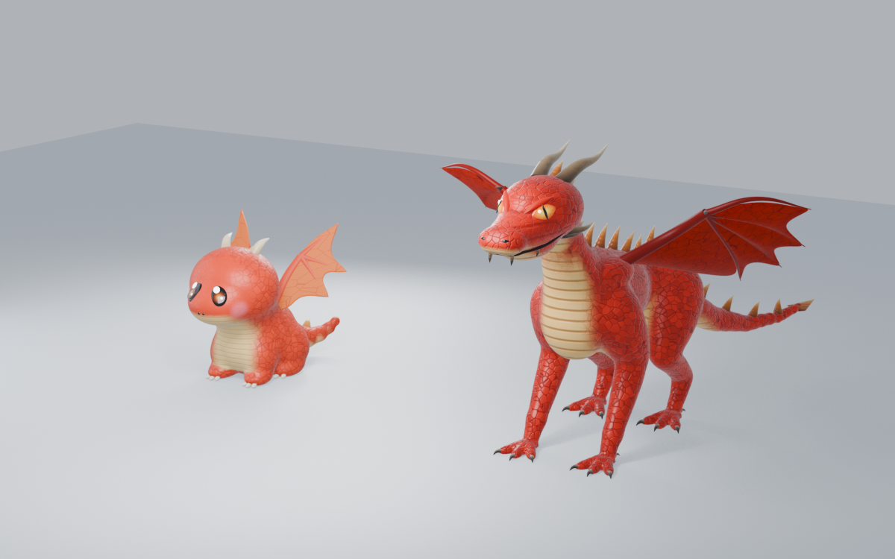

# Modèles 3D des dragons

Modèles faits dans Blender par scripts Python, pilotés depuis Claude via l'extension MCP de Blender.



## État actuel

Dragon classique (4 pattes + 2 ailes) :

| Stade | État |
|---|---|
| Bébé | Fait : style chibi, grands yeux, joues roses, textures réalistes douces |
| Ado | Fait : morphologie musclée, yeux ambre à pupille fendue, bouche et crocs, vraies pattes à doigts, ailes à os et membrane lisse, textures réalistes |
| Adulte | À faire |

À faire ensuite : l'adulte, puis les autres types (wyvern, drake, hydre, oriental, amphiptère, aquatique), et l'export vers Roblox (textures « cuites » en images).

## Contenu

- `blend/Dragon_classique_bebe_ado.blend` : la scène complète (bébé + ado, textures, éclairage).
- `scripts/` : les scripts qui reconstruisent la scène de zéro, à lancer dans l'ordre :
  1. `01_bebe.py` : scène, caméra, lumières, et le bébé
  2. `02_ado.py` : corps de l'ado (tête, bouche, yeux, cornes, pattes, ailes de base)
  3. `03_ado_textures.py` : écailles, plaques ventrales, kératine, iris, membrane
  4. `04_ado_ailes.py` : ailes naturelles (os + membrane en voile)
  5. `05_bebe_textures.py` : textures réalistes du bébé
- `rendus/` : images de référence.
- `archive_v1/` : première version (21 modèles simples générés d'un coup, abandonnée) et le module Luau de recoloration.

## Lancer les scripts

Dans Blender (onglet Scripting) ou via MCP :

```python
exec(open(r"chemin/vers/01_bebe.py", encoding="utf-8").read())
```

Les blocs de rendu à la fin des scripts 02 à 05 écrivent dans un dossier Windows (`photo dragon\wip`). Adapter le chemin si besoin.

## Technique

- Corps : métaballs fondues en un seul maillage lisse (pas de jointures).
- Couleurs et zones (ventre, écailles) : attributs de couleur par sommet `Col` et `Mask`.
- Textures : matériaux procéduraux (Voronoi pour les écailles, dégradés pour la kératine). Pour Roblox, il faudra les cuire en textures images.
